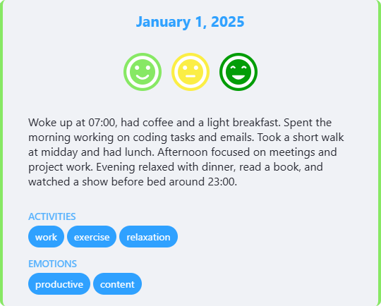
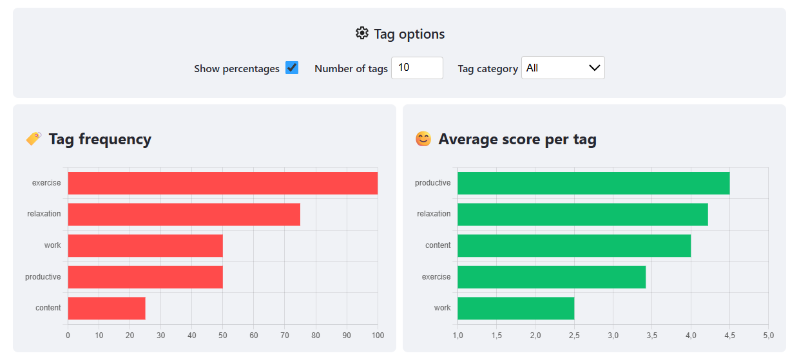
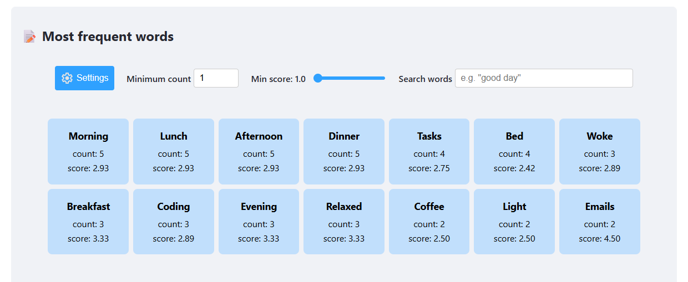
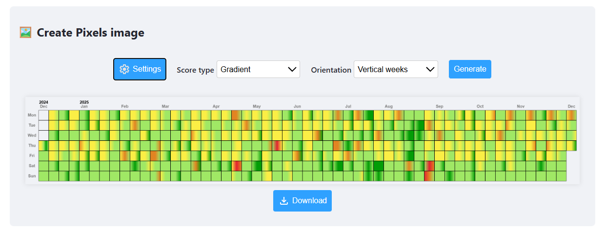

 # Pixels Visualiser - Documentation

This site helps you visualise your data from the [Pixels app](https://teovogel.me/pixels/). Everything runs locally in your browser, nothing leaves your device.

On the desktop version, you can hover every settings label to see more information about it. If that's not enough, this guide explains everything in more detail.

    

## Table of Contents
- [Pixels Visualiser - Documentation](#pixels-visualiser---documentation)
  - [Table of Contents](#table-of-contents)
  - [Glossary](#glossary)
    - [Score](#score)
    - [Pixel card](#pixel-card)
  - [Quick Start](#quick-start)
    - [Export from Pixels app](#export-from-pixels-app)
    - [Export from Daylio app](#export-from-daylio-app)
    - [Import into Pixels Visualiser](#import-into-pixels-visualiser)
  - [Choose the dates and palette](#choose-the-dates-and-palette)
  - [Time evolution](#time-evolution)
  - [Tags frequency and average score](#tags-frequency-and-average-score)
  - [Weekdays and months average scores](#weekdays-and-months-average-scores)
  - [Most frequent words](#most-frequent-words)
  - [Word cloud](#word-cloud)
  - [Create Pixels image](#create-pixels-image)
  - [Search Pixels by date](#search-pixels-by-date)
  - [Last notes](#last-notes)
  - [Troubleshooting](#troubleshooting)
  - [Contribute](#contribute)

## Glossary

### Score
The score is the numeric value of a Pixel (1 = very bad, 5 = very good).  
If a day contains sub-pixels, the displayed score is the average of those sub-pixels.  
`Mood` options also refer to this average score.

### Pixel card
The Pixel card shows the date, score icons, notes and tags for a specific day.

    

## Quick Start

### Export from Pixels app

To get the file from the Pixels app: open Pixels -> Settings -> `Export Pixels data` and save the file to your device.  

    

### Export from Daylio app

To get the file from the Daylio app: open Daylio -> More -> Export Entries -> `CSV (table)` and save the file to your device.

### Import into Pixels Visualiser

1. Open [pixels-visualiser.gatienh.fr](https://pixels-visualiser.gatienh.fr/) in your browser.
2. Click `Choose or drop a backup file` and select the exported backup file (you can also drag-and-drop your exported .json/.csv file onto the page). 

## Choose the dates and palette

Use the top range pills (e.g. `Last month`, `All time`) or `Custom` to pick exact start/end dates. Customize palette colors in the palette panel and click `Apply` to update visuals.

    

## Time evolution

This chart displays how daily scores change over time.

Options:
- `Rolling average`: smooth the line by averaging scores over N days (example: 7-day average on June 8 = average of June 2–8).
- `Show average`: horizontal line showing the mean score for the selected period.
- `Show years`: vertical markers for each year start.
- `Show Pixel`: when enabled, hovering a point shows the Pixel card; otherwise only clicking shows the card.
- `Option to display`: 
  - `Mood`: daily average score
  - `Number of words`: notes word count
  - `Number of tags`: tags count
  - `Number of Pixels`: sub-pixels count.

    

## Tags frequency and average score

See which tags appear most often and their average scores. On desktop, hovering a tag in one chart highlights it in the other.

Options:
- `Show percentage`: frequency as percentage of days in the selected range (not occurrences).
- `Number of tags`: limit displayed tags.
- `Tag categories`: filter by tag category.

    

## Weekdays and months average scores

View averages by weekday or month to spot patterns.

Options:
- `First day of week`: choose which day the week starts on.
- `Season colors`: color months by season.

    

## Most frequent words

This lists the most frequent words from notes and provides search/filter options.

Options:
- `Minimum count (n)`: only show words that appear at least `n` times.
- `Min score (x)`: only include words from Pixels with score ≥ x.
- `Search words`: Search words: find specific words or phrases in your notes.

More settings:  
Open the additional settings panel by clicking the "Settings" button.
- `Show percentage`: display how often each word appears as a percentage (instead of a count) of total days in the selected period. /!\ If you word is used twice a day, it counts as 2 occurrences, so you can have words with more than 100%.
- [TODO] Limit to one per day: only count a word once per day, even if it appears multiple times in the same note. The resulting percentage will then reflect the number of days the word appeared in, not the total number of occurrences.
- `Order by score`: sort words by average score instead of frequency.
- `Number of words`: limit how many words are shown in the list.
- `Stopwords`: you can choose a stopword language to add common words to ignore. You can remove stopwords from this list, or add your own custom stopwords. /!\ Remember that changing the stopword language will reset the "Default stopwords" list.

Advanced search patterns:  
You can try this type of search if you are familiar with search patterns.  
Remember, searches always uses **all the parameters above** (number of words, min score, stopwords, etc.), if you don't see expected results, try changing those settings.

- `*`: In the "Search words" box, use `*` as a wildcard to match unknown words, like "ate with *" to find all words that come after "ate with".
  
- `* *`: You can use multiple `*` in a search, for example "ate * with *" to find notes like "ate sandwich with Alice" or "ate pizza with Bob".  
    3 types of word cards are then shown:
    - Whole match: notes that exactly match the search (e.g., "ate pizza with Bob")
    - First word match: first word matched by a wildcard (e.g., "sandwich", "pizza", etc.)
    - Second word match: second word matched by a wildcard (e.g., "Alice", "Bob", etc.)
  - `/`: Adding a `/` after your search (e.g., "ate * with */") will show which words have been matched with each wildcard (e.g. "1-Alice", "2-Pizza", etc.).

- `***`: You can also use `***` to match *any sequence of words*, not just a single word like `*`.
    This is useful when you don’t know how many words appear between two parts of a sentence.
    - Example: `ate ***` will match "Tom", "Pizzawith Tom", "Tom at home", etc...

- `***[][]`: You can add stop-conditions using square brackets to stop the match at first occurence of words/chars in the brackets.
    - Example: `ate ***[with][,][.]` when applied to "ate pizza and fries with tom" will match "pizza", "pizza and fries" but NOT "pizza and fries with Tom".
    - Important note: if your `***` returns multiple words, those words are split and counted separately. 
      For example, when searching for `ate ***[with]`, if you have notes like "ate pizza and fries", it will count +1 for "pizza" and +1 "pizza and fries" separately.  

    

## Word cloud

Create a word cloud from the Most frequent words list. Download as PNG using the `Download` button.

Options:
- `Word size`: choose the size of the words in the cloud.
- `Word spacing`: adjust the spacing between words.
- `Word compression`: an higher compression will make different words have similar sizes, while a lower compression will make the size difference more pronounced.

    

## Create Pixels image

Export a visual representation of your Pixels as an image.

Options:
- `Score type`: choose which score is used to color the pixels. 
  - `Gradient`: continuous gradient across sub-Pixels like in the original app.
  - `Blend average`: mix palette colors when score is fractional (e.g. 4.5 mixes colors for scores 4 and 5).
  - `Rounded average`: round to nearest integer (e.g., 4.5 becomes 5).
  - `First/last/max`: use single sub-pixel score where multiple sub-pixels are used.
- `Orientation`: choose how you want the calendar to be laid out.

More settings:  
Open the additional settings panel by clicking the "Settings" button.
- `Square size (px)`: size of each Pixel square in the image.
- `Show border`: add a border around each Pixel square.
- `Show legend`: include a legend to show years, months and days.
- `Show days`: include the day on each Pixel square.
- `Word filter`: filter which Pixels are included based on notes content. Possible options:
  - `Hide`: no filter, include all Pixels.
  - `Filter words`: only include Pixels whose notes contain the specified tag or word/sentence.
  - `Compare words`: display the Pixels whose contains the first tag/word in one color, and those that contain the second tag/word in another color (your palette colors for 1 and 5 will be used). If the Pixel contains both words, the color for score 3 will be used.
  - `Exclude words`: shows all Pixels that contain the first tag/word but *do not* contain the second one.

    

## Search Pixels by date

Type a date or enable `Use calendar` to pick a date. After selecting a date, the Pixel card is shown (if present) and you can navigate to previous/next day and previous/next year.

## Last notes
- Use `Enter` to confirms dialogs.  
- If you want to change the locale used for date formatting (in the Pixels image legend for example), use `userLocale = "en-US"` in the browser console, replacing `en-US` with your desired locale code (e.g., `fr-FR` for French, `es-ES` for Spanish, etc).

## Troubleshooting

- Import errors:
  - If the import fails, make sure you exported the correct file from the Pixels app.
  - In some cases, uploading the file to Google Drive and downloading it again can corrupt the file. Try re-exporting it from the Pixels app.

- Word search shows no results:
  - You might have a high `Minimum count` value, which hides low-occurrence words. Try lowering it.
  - Same for `Min score`: low-score Pixels might not be included. Try lowering it.

## Contribute

If you have suggestions to improve this website, spotted a bug, or want to contribute code, feel free to open an issue directly on this [GitHub repository](https://github.com/Leogendra/Pixels-Visualiser/issues).